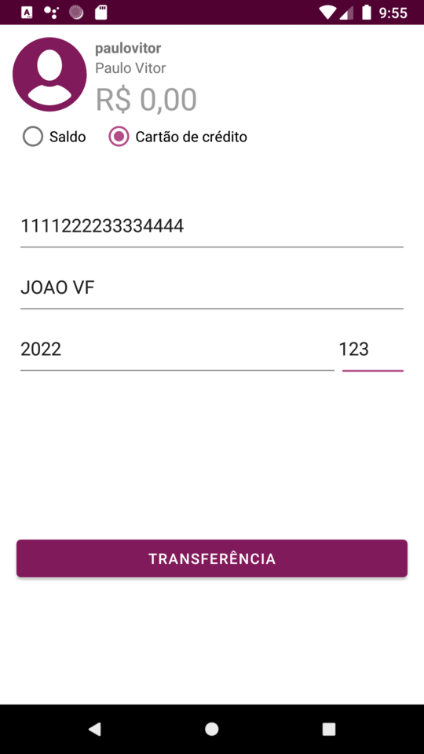
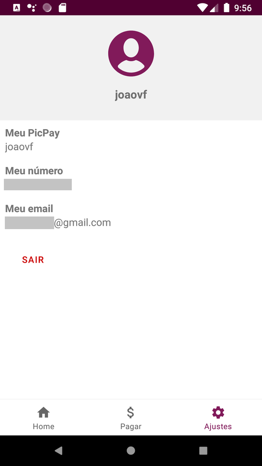

# CóriaPay by chicorasia :euro::money_with_wings::heavy_dollar_sign:

App desenvolvido no desafio da Digital Innovation One Pro :orange_heart:. Simula funcionalidades de um aplicativo popular de transferências e pagamentos peer-to-peer.

A solução tem como características: 

- Uso progressivo de DataBinding para comunicação direta entre ViewModel e componentes da UI
- Autenticação JWT
- Não emprega o plugin depreciado 'kotlin-extensions'; em seu lugar, o app faz uso de ViewBinding e 'kotlin-parcelize'
- Controle de visibilidade de componentes por meio de ViewModel específico (ComponenteViewModel)
- Injeção de dependências com Koin
- Emprego de melhores práticas de organização do código e Clean Architeture
- Sintaxe moderna e idiomática

***
:earth_africa: O App consome esta API: https://github.com/cicerojmm/picPayCloneMentoriaDIO
***

****
Digital Innovation One Pro :orange_heart: 
****
:computer: https://chicorialabs.com.br/blog
