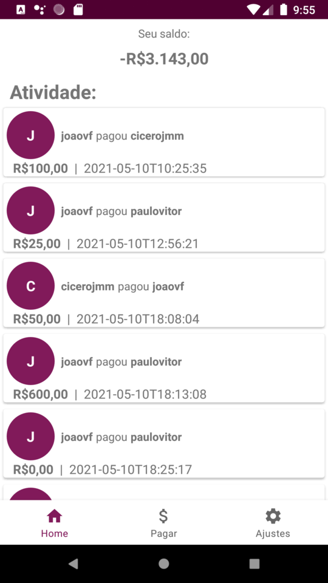

# picpayclonekt-app by chicorasia

PicPay Clone App.

- Emprego de ViewBinding e 'kotlin-parcelize'em lugar de 'kotlin-extensions'
- Controle de visibilidade de componentes por meio de ViewModel específico (ComponenteViewModel)
- Injeção de dependências com Koin
- DataBinding para comunicação direta entre ViewModel e componentes da UI

***
:earth_africa: O App consome esta API: https://github.com/chicorasia/picpayclone-kt-v2
***

****
Digital Innovation One Pro :orange_heart: 
****
:computer: https://chicorialabs.com.br/blog
